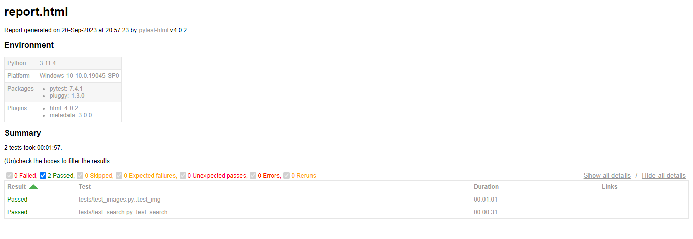

# **Тестовое задание на позицию разработчика в тестировании (Тензор)

### Необходимо автоматизировать проверку 2-х сценариев:

### Поиск в яндексе:
1)	Зайти на https://ya.ru/
2)	Проверить наличия поля поиска
3)	Ввести в поиск Тензор
4)	Проверить, что появилась таблица с подсказками (suggest)
5)	Нажать enter
6)	Проверить, что появилась страница результатов поиска
7)	Проверить 1 ссылка ведет на сайт tensor.ru
 
### Картинки на яндексе:
1)	Зайти на ya.ru
2)	Проверить, что кнопка меню присутствует на странице 
3)	Открыть меню, выбрать “Картинки”
4)	Проверить, что перешли на url https://ya.ru/images/
5)	Открыть первую категорию
6)	Проверить, что название категории отображается в поле поиска
7)	Открыть 1 картинку
8)	Проверить, что картинка открылась
9)	Нажать кнопку вперед
10.	Проверить, что картинка сменилась
11.	Нажать назад
12.	Проверить, что картинка осталась из шага 8

### Правила выполнения задания:
1)	Автотесты реализованы на Python 3 и Selenium Webdriver
2)	В качестве тестового framework используется pytest
3)	Реализован паттерн PageObject
4)	Приветствуются любые сторонние библиотеки для логирования, отчетов, selenium wrapper
5)	Готовый проект залит на github / gitlab без кешей, драйверов и виртуальных окружений.
---
### Стек:
- python 3.11
- selenium 4.12.0
- pytest 7.4.1
- pytest-html 4.0.2
- logging 0.4.9.6
---
### Описание проекта:
Проект состоит из 2 папок:
- `pages`
- `tests`

В папке `pages/` находятся файлы `base_page.py`, `yandex_image.py` и `yandex_search.py`. 
Файл `base_page.py` - реализует в себе необходимые методы для работы с webdriver. Файлы `yandex_image.py` и `yandex_search.py`реализуют 
методы для работы с элементами на веб-страницах.

В папке `tests/` находятся файлы `conftest.py`, `test_images.py` и `test_search.py`.
Файл `conftest.py` - файл с фикстурами. Файлы  `test_images.py` и `test_search.py` содержат непосредственно сами тесты.
---
### Запуск тестов:
Поиск в яндексе:
```bash
python -m pytest tests/test_search.py
```
Картинки в яндексе:
```bash
python -m pytest tests/test_images.py
```
Оба теста:
```bash
python -m pytest 
```
---
### Создание отчетов
```bash
python -m pytest --html=report.html    
```
Пример сгенерированного отчета:

---
Логгирование:

Необходимо больше разобраться в теме и доработать эту часть  